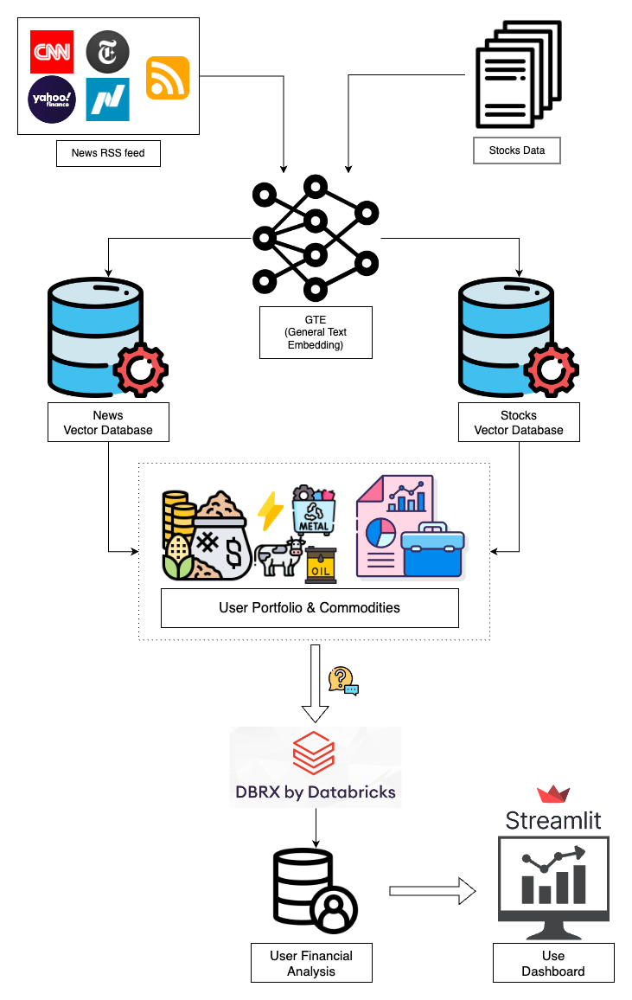

<div align="center">

# 24Finance

[]()

[](https://github.com/astral-sh/ruff)
[](https://github.com/PyCQA/bandit)
[](https://github.com/artefactory-nl/artefact-hackathon-team-04/blob/main/.pre-commit-config.yaml)
</div>

24Finance is a tool that allows users to check the impact of events on their investment portfolio, at a global scale.

This application was built by the **Team DataChicks** to compete in the [Databricks Generative AI World Cup](https://generativeai-worldcup.devpost.com/).

All credits to:

alberto.stella@artefact.com

simge.yildiz@artefact.com

koen.rodewijk@artefact.com

## Repository Structure

```
.
├── .github    <- GitHub Actions workflows and PR template
├── bin        <- Bash files
├── config     <- Configuration files
├── dist       <- python wheels
├── docs       <- Documentation files
├── lib        <- Python modules
├── notebooks  <- Jupyter notebooks
└──secrets    <- Secret files (ignored by git)
```

## Solution Workflow
24Finance uses 2 tables as input data:
* Portfolio Data: table containing details about the investment portfolio of the user
* News Data: table containing details about global events

These are the steps that are executed by the workflow:
1. Understand in which countries each company, in which the user invested, operates
2. Create a short description of each company
3. Match the global news with the companies concerned by the portfolio
4. Web scraping to extract the content of the news
5. Summarise the news
6. Extract news titles
7. Understand the impact of each news on the portfolio investments
8. Justify the impact of each with 3 reasons




## Installation

To install the required packages in a virtual environment, run the following command:

```bash
make install
```
In order to package all the functions and dependencies to be used on Databricks, let's create a python wheel executing the command:
```bash
python setup.py sdist bdist_wheel
```
This wheel can then be uploaded and installed directly on the cluster.

## Usage

The application is made of 2 main parts:
- GenAI Engine: workflow based on [lemonfox.ai](https://www.lemonfox.ai/) API that outputs results in a csv file inside the folder [data](data).
- Visualization Layer: Streamlit user interface fed by the csv file inside the folder [data](data).

To run the entire solution, follow the steps described here below:
1. Clone the repository on Databricks
    1. Make sure the python wheel is installed either on the cluster
2. Clone the repository locally
    1. Install the conda environment with ```make install``` and activate it
3. Run the notebook [24finance](notebooks/24finance.ipynb) inside Databricks
4. Collect the csv that was created in the folder [data](data) and download it in the same location in the local repository
6. run the command ```streamlit run lib/viz/dashboard_side_menu.py``` to visualise the results

Otherwise, some precomputed results can be already visualized, as the folder [data](data) was populated with an output file. To do that, just run the command:
```streamlit run lib/viz/dashboard_side_menu.py```.